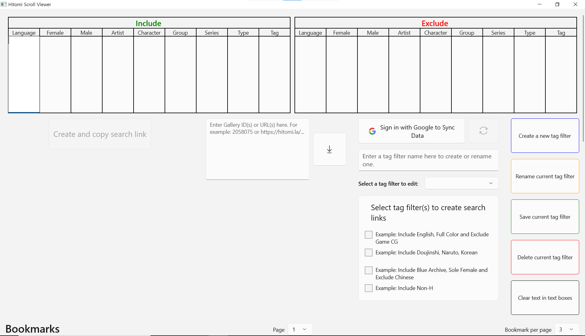
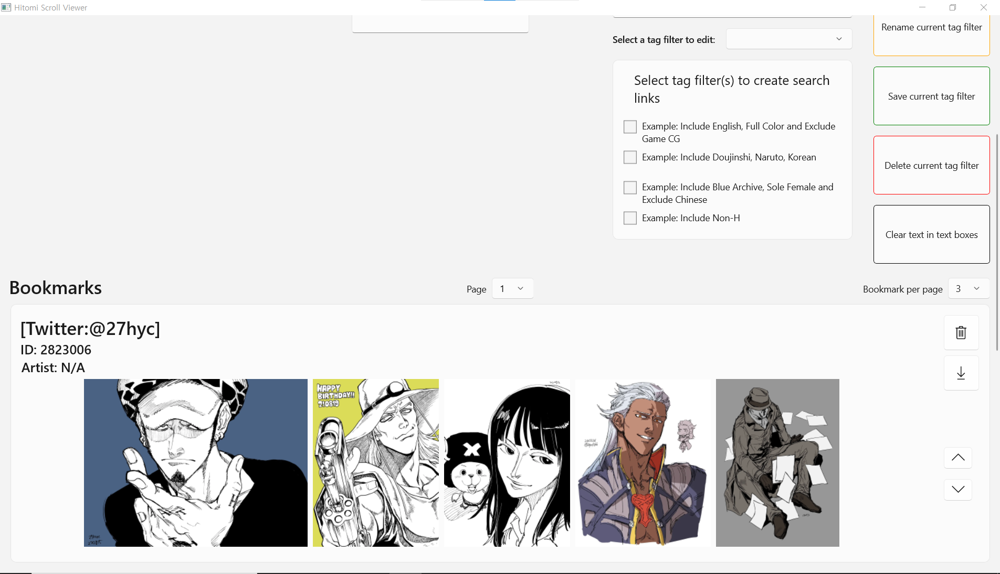

# 히토미 스크롤 뷰어

### 지원되는 OS: Windows 10, 11

여러가지 기능들이 있는 hitomi.la (18+)를 위한 뷰어.

WinUI 3와 C#으로 개발했습니다.

현재 지원되는 언어: 영어, 한국어

## 미리보기

    
    
    

## 기능들
- 조합 가능한 태그 필터로 검색 링크 생성
- 갤러리 다운로드
- 자동 스크롤
- 읽는 방향 바꾸기
- Google 계정을 이용해서 데이터를 Google Drive에 동기화

## 설치법
만약에 앱 버전을 2.x.x.x 에서 2.x.x.x로 업그레이드 하는 경우라면 2번을 건너뛰어주세요. 그 외 경우에는 모든 순서를 따라서 설치하면 됩니다.
1. `Hitomi-Scroll-Viewer.cer`와 `Hitomi-Scroll-Viewer_x.x.x.x.msixbundle` 파일을 [다운로드](https://github.com/kaismic/Hitomi-Scroll-Viewer/releases/latest) 해주세요.
2. `Hitomi-Scroll-Viewer.cer` 파일을 연 후 -> 인증서 설치 -> 로컬 컴퓨터 -> 모든 인증서를 다음 인증소에 저장 -> 찾아보기 -> 신뢰할 수 있는 사용자 -> 다음 -> 마침.
3. `Hitomi-Scroll-Viewer_x.x.x.x.msixbundle` 파일을 실행 후 설치해주세요. (주의: 설치 과정에서 진행률이 15% 정도가 되었을때 설치가 멈춘 것 처럼 보일 수 있으나 멈춘 것이 아니며 보통은 10분 이내로 완료됩니다.)
4. 만약에 "You must install .NET Desktop Runtime...", 라는 창이 나오면 그대로 따라서 설치해주세요.

## 사용법 / 조작법
- 검색 페이지:
    - 태그 필터 입력칸에는 엔터키를 이용해서 한 줄에 태그 필터를 하나씩 입력해주세요.
    - 태그 필터를 편집한 후 검색 링크를 생성하기 전에 저장을 해야 제대로 적용이 됩니다.
- 감상 페이지:
    - 마우스를 창 끝 위로 올리면 설정 메뉴가 나옵니다.
    - 스페이스바로 자동 스크롤 시작/정지.
    - `L` 키로 자동 스크롤 중일때 루프 켜기/끄기.
    - 왼쪽/위쪽 화살표와 오른쪽/아래쪽 화살표 또는 마우스 휠로 페이지 바꾸기.
