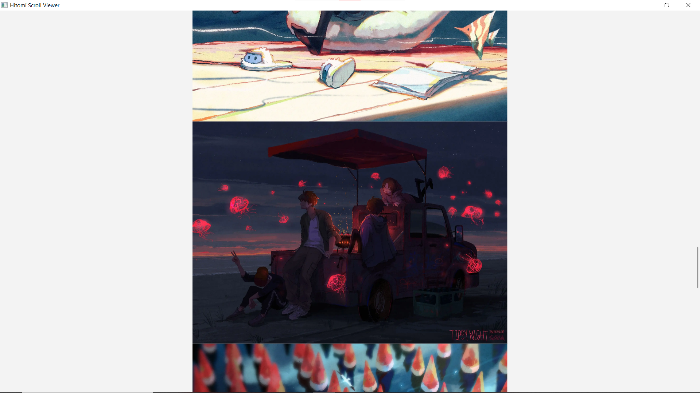
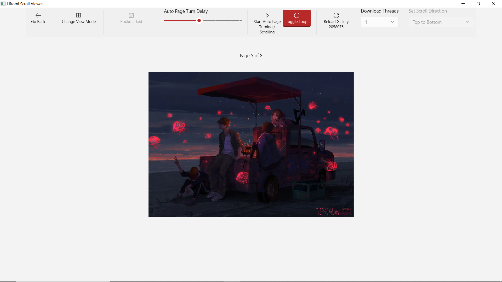

# Hitomi Scroll Viewer
A viewer for [hitomi.la (18+)](https://hitomi.la) with features such as auto scrolling, searching by tags and downloading.

Built using C# .NET 6, WinUI 3

## Preview

    
    
    
    
    

## Features
- Search galleries with multiple tag filters
- Auto scrolling / Auto page turning
- Download galleries
- Change view direction
- Image zooming in/out

## Controls
- Doubleclick to switch between pages

In image watching page:
- Press Spacebar to start/stop auto page turning/auto scrolling
- Press `L` key to enable/disable loop when auto page turning/auto scrolling
- Press `V` key to change view mode (Default/Scroll)
- Hold `Ctrl` key and use mouse wheel or `+`, `-` key to zoom in/out
- In Default mode:
    - Use left / right keys to switch between images

## Notes
- It is not recommended to download a large number of galleries together or downloading with large thread number because hitomi.la throws 503 error on rapid request above its API rate limit.
