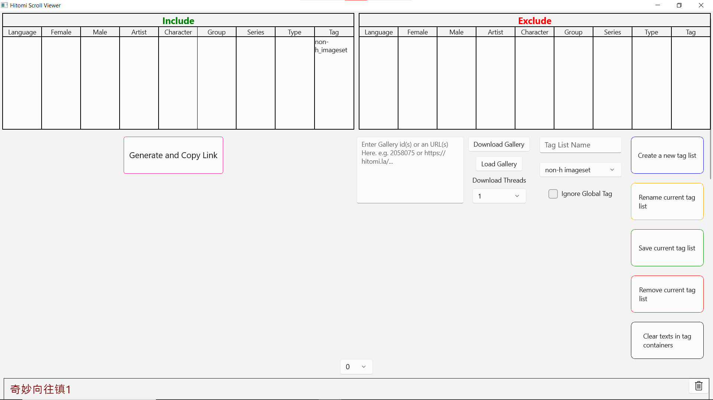
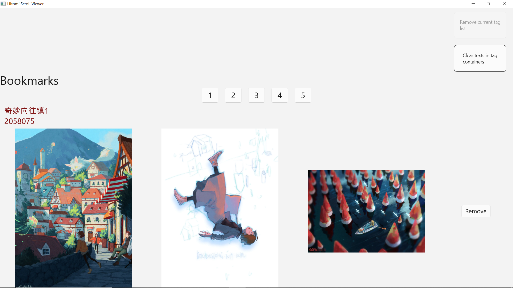
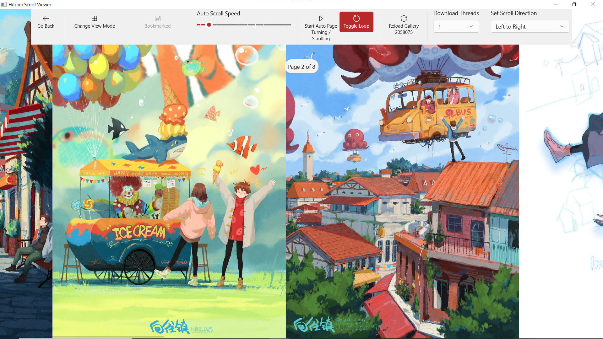

# Hitomi Scroll Viewer

## Preview (old version)

    
    
    

## Controls
- Doubleclick to switch between pages

In image watching page:
- Press spacebar to enable/disable auto page turning/auto scrolling
- Default mode:
    - Use (Left/Right) (keys/mouse buttons) to switch between images

## Bugs
### Critical
1. Currently memory leaks occur when you load images and switch between pages. It is likely that the bug exists due to this issue: https://github.com/microsoft/microsoft-ui-xaml/issues/5978
### Non-critical
1.
    https://github.com/soobakjonmat/Hitomi-Scroll-Viewer/blob/0f0fa705c211e4094ce43473598d7bfb57b5dc78/Hitomi-Scroll-Viewer/SearchPageComponent/TagContainer.xaml.cs#L13-L19
    Refer to this issue: https://github.com/microsoft/microsoft-ui-xaml/issues/1826
