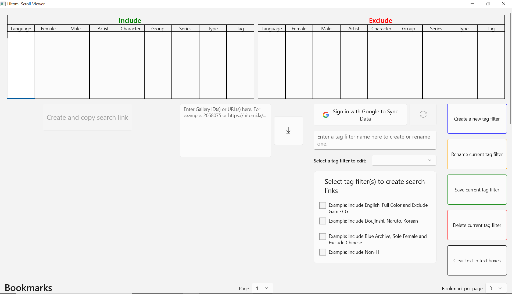

# Hitomi Scroll Viewer

### ~~(14 Mar 2025): Currently, the app is under the process of a complete re-design and refactoring for a new web browser-based app and I do NOT recommend downloading the currently released version (v2.1.1)~~
### (07 May 2025): This repository is no longer maintained and has migrated to [here](https://github.com/kaismic/Hitorus)

*Read this in other languages:* [한국어](README-ko-KR.md)

### Supported OS: Windows 10, 11

A viewer for hitomi.la (18+) with various features.

Built using WinUI 3 with C#.

Currently supported languages: English, Korean

## Preview

    
    
    

## Features
- Create search links with combinable tag filters
- Download galleries
- Auto scrolling
- Change view direction
- Sync data on Google Drive with Google Account

## How to install
If you are updating the app from version 2.0.0 onwards, please skip step 1. Otherwise, follow all the steps.

[Download link](https://github.com/kaismic/Hitomi-Scroll-Viewer/releases/latest)
1. Download and open `Hitomi-Scroll-Viewer.cer` -> Install Certificate-> Local Machine -> Place all certificates in the following store -> Browse -> Trusted People -> Next -> Finish.
2. Download and install `Hitomi-Scroll-Viewer_x.x.x.x.msixbundle`. (Note: The installation might seem stuck at around 15% but it is in progress and should normally take no more than 10 minutes.)
3. If a window pops up saying "You must install .NET Desktop Runtime...", install it.

## Usage / Controls
- In Search page:
    - Enter one tag filter term at each new line in text boxes using the enter key.
    - After editing a tag filter, you must save it to apply the changes before using it to generate search links.
- In View page:
    - Move the mouse to the top of the screen to show the settings menu.
    - Use the spacebar to start/stop auto-scrolling.
    - Press the `L` key to enable/disable the loop when auto-scrolling.
    - Use the left/up and right/down arrow keys or mouse wheel to switch between pages.

### App data storage location
`C:\%USERPROFILE%\AppData\Local\Packages\Hitomi-Scroll-Viewer_s0425mpvxwf9w\LocalCache\Roaming\HSV`
